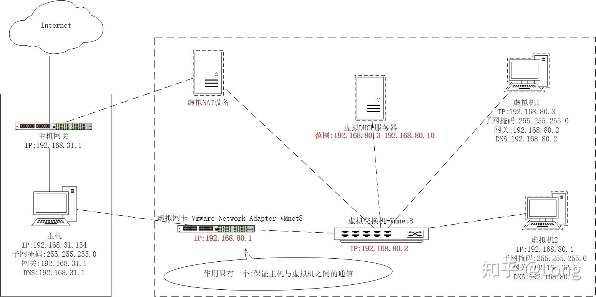

# VMWare虚拟机搭建数据库并让**外网**可连接，并提供WEB GUI操作数据库

## 快速开始(Windows)

下面我的外网IP地址端口为800是因为我设置的端口转发是 800->80 因为本人的80端口已被占用(顺带一提，是OpenWRT的Luci)

1. 克隆仓库到本地

2. 在项目根目录使用cd命令切换到php-8.4.6-Win32-vs17-x64文件夹下

3. 使用命令php-cgi -b 127.0.0.1:9000 -c php.ini 开启php-cgi (开启后不要关闭cmd窗口，否则会失效)

4. 切换回根目录，打开nginx-1.26.2目录

5. 用文本编辑器打开html/index.php文件，修改`<a href="xxx">`超链接标签下的IP地址，更改为你的外网IP地址

   

6. 关闭编辑器，依次打开phpMyAdmin/libraries/config.default.php

7. 修改configdefault.php文件的配置

   ```php
   $cfg['PmaAbsoluteUri'] = 'http://172.23.40.32:800/phpmyadmin/'; # 修改为你的外网IP地址
   
   $cfg['blowfish_secret'] = 'XyZ@1aBcD#9EfGhI%7JkLmN0OpQrStUvWxYz!'; # 可不动 或按注释修改
   
   $cfg['Servers'][$i]['host'] = '192.168.137.128'; # 修改为你的数据库IP
   
   $cfg['Servers'][$i]['port'] = ''; # 修改为你的数据库端口，如果为3306可留空
   
   $cfg['Servers'][$i]['user'] = 'criminal'; # 修改为用这个界面连接数据库的数据库用户名
   
   $cfg['Servers'][$i]['password'] = 'crazy4thdayv50'; # 上面用户名对应的密码
   ```

8. 退回nginx目录，双击nginx运行

9. 访问 http://你的IP地址:端口/ 即可看到主页，如果在内网没有开启NAT环回请用内网IP访问

10. 大功告成！现在你的VMWare可以对外提供网络服务，并且你跑在虚拟机上的MYSQL数据库也有了web页面可以轻松访问，通过主机的nginx转发请求，让你的主机有了一个相对安全的环境(即使虚拟机崩溃也对宿主机没什么影响)

    成果图：

    

    

    

    

## 概述

这里记录了我这边在自己电脑的VMWare Ubuntu22.04系统上开启数据库并提供给外网连接的历程，

你将收获：

- VMWare虚拟机在NAT模式下的网络拓扑结构
- 如何在虚拟机开启一些网络服务(例如数据库服务和web服务)并让**外网**可访问(这里的外网指的是连接WAN口的路由器的WAN口IP地址)
- 如何让数据库能够对外提供基于Adminer/phpMyAdmin的web服务以随时随地轻松访问数据库

### 一、VMWare在NAT模式下的网络拓扑图



*如上图所示，转自知乎*

#### 1.请求路径

请求到达主机网关->通过主机网关端口映射(端口转发)把请求路由到主机->主机通过一些工具转发请求到虚拟机(中间经过了虚拟网卡和虚拟交换机，可以不太深究)

#### 2.虚拟机上网流程

虚拟机发起网络请求->到达交换机->到达虚拟网卡->虚拟网卡通过网络共享，使用主机的物理网卡和主机的IP发送数据

这也就是为什么有时候NAT模式不能上网，通过修改这里的设置可以让虚拟机联网


### 二、如何在虚拟机开启网络服务并供外网访问

#### 1.不要使用VMWare自带的端口映射功能

本人历经千辛万苦，看网上的教程使用了虚拟机自带的端口映射功能，无法到达预期的结果，**只能在局域网内访问**到VMWare映射后的虚拟机，功能如下图所示


#### 2.使用VMWare自带的端口映射功能出现的问题

路由器开启了NAT环回，NAT环回简单理解就是能够在内网（局域网）使用外网IP来正常访问设备，这种情况下在内网是可以正常使用外网IP访问主机，然后主机会把请求转发到虚拟机

但是当把网络环境切换到外网后，访问就会失效，请求能正常到达主机，但是主机不会把外网的请求转发给虚拟机！所以后面使用其他方法进行转发时一定要关闭VMWare的端口转发（即4框出的范围里没有任何记录）

#### 3.解决方案

使用nginx的stream来转发所有的连接。

在nginx中配置stream来监听主机的端口并转发请求到虚拟机，这样的话外网的请求是能够顺利到达的，nginx配置文件仅供参考，替换为自己想要的端口即可，注意这里的stream块是与http块同级别

再次提醒：使用NGINX转发也一定要关闭VMWare的端口转发功能，否则外网的请求一样无法到达虚拟机


### 三、提供WEB GUI以操作运行在虚拟机上的数据库

这里给出了两个解决方案，一个是Adminer(轻量级单php文件实现，推荐)，一个是phpMyAdmin(这个页面有点太华丽了，不知道什么原因访问很慢，不太推荐)，这里都在nginx中有配置，遵循下面的”快速开始“以配置你的数据库可通过web页面访问

### 四、最佳实践：性能提升(windows的php-cgi实在过于慢了)

可以使用Adminer，响应速度已经还是算不错了，如果还想提升性能可以考虑更换php，这里用了个线程安全版本的，可能是因为这个原因导致速度会慢了不少


2025.5.1更新：更换非线程安全版本后，速度并没有提高多少。的确是php-cgi拖慢了整体的速度，因为php-cgi在windows上的性能很差，这边**把php-cgi替换为了只有linux上有的php-fpm**(多线程版本的，性能更好的php-cgi)，然后更改了nginx配置文件如下所示：

```nginx

worker_processes 4;


events {
    use select;
    worker_connections 65535;
    multi_accept on;
}

stream {
	# MC服务器 25565 TCP转发
    server {
        listen 25565;
        proxy_pass 192.168.137.128:25565;
        proxy_timeout 60s; # 增加超时控制
    }
	# Mysql服务器 3306 TCP转发
	server {
        listen 3306;
        proxy_pass 192.168.137.128:3306;
        proxy_timeout 60s; # 增加超时控制
    }
}

http {

	
    include       mime.types;
    default_type  application/octet-stream;
    keepalive_timeout  65;
	sendfile on;
	tcp_nopush on;
	tcp_nodelay on;
	
	# 启用 Gzip 压缩
    gzip on;
    # 设置压缩的文件类型
    gzip_types text/plain text/css application/json application/javascript;
    # 最小压缩文件大小（50KB 以上才压缩）
    gzip_min_length 50k;
    # 其他可选优化参数
    gzip_comp_level 6;
    gzip_vary on;
    gzip_proxied any;

	server {
		listen 80;
		root html;
		index index.php index.html;		

		
		# 允许代理或浏览器缓存静态资源加快速度
		location ~* \.(js|css|png|jpg)$ {
			expires 30d;
			add_header Cache-Control "public";
		}
		
		location / {
			# 首先检查文件 然后视为目录 检查目录下是否有默认文件(index配置里的文件) 还灭有返回404_
			try_files $uri $uri/ =404;
		}

		location ~ \.php$ {
			#fastcgi_pass 127.0.0.1:9000; # Windows使用fast-cgi时的配置
			fastcgi_pass 192.168.137.128:9000; # Linux使用php-fpm时的配置
			fastcgi_index index.php;
			#fastcgi_param SCRIPT_FILENAME $document_root$fastcgi_script_name; # Windows上使用
			fastcgi_param SCRIPT_FILENAME /var/www/html$fastcgi_script_name; # 使用虚拟机php-fpm时使用
			include fastcgi_params;
			error_log php_error.log debug;  # 记录调试信息
		}
	}


   

}
```

#### 踩坑

我这里的架构是：宿主机运行nginx，虚拟机的docker运行mysql，虚拟机本身运行php-fpm

因为这边的nginx因为要把请求转发到虚拟机里，所以就只能在宿主机运行了。

然后这里的.php文件的逻辑是：先找有没有，有了再拼接SCRIPT_FILENAM参数发送到虚拟机的php-fpm中，然后php-fpm会根据这个传入的参数寻找虚拟机中的文件，再做出响应，这就造成一个问题：

非.php文件，主机的nginx会直接返回，所以直接存在主机即可；.php文件，由于nginx请求进来会先找有没有这个文件，有的话才会把路径(而并非文件本身)转发给php-fpm处理，如果没有的话会直接返回`404 Not Found`页。因此，**.php文件要在宿主机和虚拟机中存有两份**，最终返回的是虚拟机中的文件(宿主机中只有文件名没有内容都可以，就是为了骗过nginx文件是存在的从而避免它返回404错误)


还有就是，`php-fpm+phpMyAdmin`的组合在linux上的默认连接行为是使用unix-socket(速度要快一些)，而在windows上是直接使用tcp连接。并且本人暂时没有发现在linux上能把`php-fpm+phpMyAdmin`的组合连接数据库的方式改为tcp，因此，**如果你的mysql数据库运行在docker容器里，需要把mysqld.sock文件挂载到宿主机，然后去设置一下fpm的php.ini配置文件**，即可让phpMyAdmin连接成功了，而Adminer就没有这个问题。


还有一点，php-cgi(Windows中)在寻找文件的时候是不区分大小写的，因此刚开始我的导航页的phpmyadmin可以正常访问，而linux的php-fpm是区分大小写的，这点要注意一下，不然会报`File not found.`错误

把windows上的php-cgi换成linux的php-fpm后，运行速度提升巨大，两个页面现在都可以流畅、完全不卡顿的运行(这时再卡顿可能是设备本身性能不佳或是网速问题)，真正的可以在生产环境使用！


所以，如果你要用虚拟机对外提供服务数据库服务，并要配置WEB UI

#### 最佳实践

- 在宿主机上使用nginx转发连接到虚拟机
- 基于php的web ui，要在linux上运行php-fpm而不是使用windows的php-cgi


最后，ENJOY!